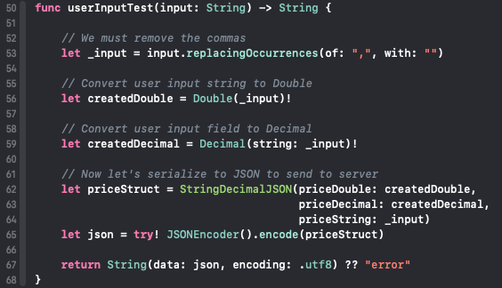
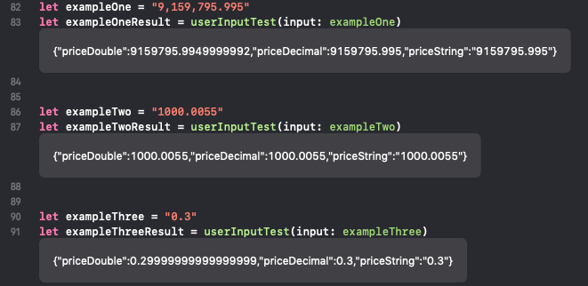
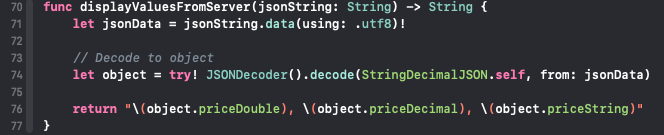
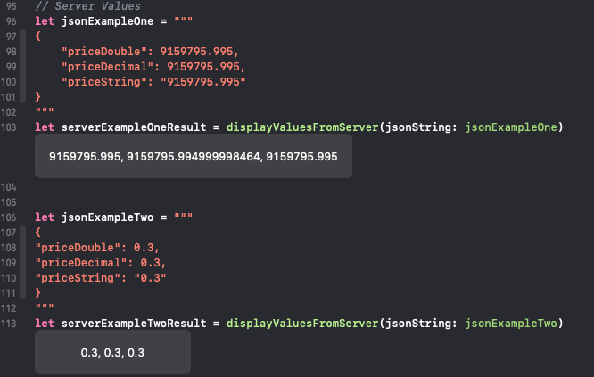

# JSON Numbers 

Examples run on MacOS Mojave 10.14.2

`$ swift -version
Apple Swift version 4.2.1 (swiftlang-1000.11.42 clang-1000.11.45.1)
Target: x86_64-apple-darwin18.2.0`

## User Input Example

## Results

## Server Response Example

## Results

